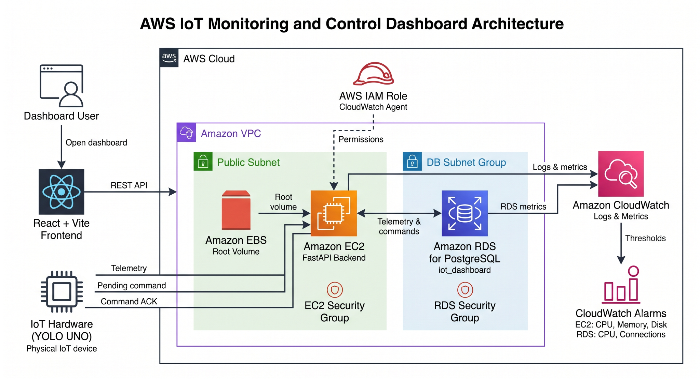

# AWS IoT Monitoring and Control Dashboard

Hệ thống giám sát và điều khiển thiết bị IoT sử dụng FastAPI, React, PostgreSQL, YOLO UNO và các dịch vụ AWS.

[English](README.md)

---

## 1. Tổng quan

Project xây dựng một hệ thống giám sát và điều khiển IoT hoàn chỉnh từ thiết bị phần cứng đến giao diện người dùng.

Thiết bị **YOLO UNO** thu thập nhiệt độ, độ ẩm và cường độ ánh sáng, sau đó gửi telemetry đến FastAPI backend chạy trên Amazon EC2. Backend lưu dữ liệu vào Amazon RDS for PostgreSQL. Dashboard React + Vite hiển thị dữ liệu mới nhất, dữ liệu lịch sử và cho phép người dùng điều khiển quạt, đèn và rèm từ xa.

Hardware định kỳ lấy command mới nhất từ backend, thực thi command và gửi ACK xác nhận. Amazon CloudWatch được dùng để thu thập log backend và theo dõi metric của EC2 và RDS.

### Chức năng chính

- Thu thập nhiệt độ, độ ẩm và cường độ ánh sáng.
- Lưu telemetry vào PostgreSQL trên Amazon RDS.
- Hiển thị telemetry mới nhất và dữ liệu lịch sử.
- Điều khiển quạt, đèn và rèm từ xa.
- Quản lý trạng thái command từ `Pending` sang `Executed`.
- Hardware gửi ACK sau khi thực hiện command.
- Backend chạy bằng `systemd` trên EC2.
- Theo dõi EC2, RDS và log backend bằng Amazon CloudWatch.

---

## 2. Kiến trúc

<p align="center">
  
</p>

Kiến trúc hệ thống gồm:

- Frontend React + Vite chạy bên ngoài AWS.
- FastAPI backend được triển khai trên Amazon EC2.
- Amazon RDS for PostgreSQL lưu telemetry và command.
- YOLO UNO gửi telemetry, lấy command Pending và gửi ACK sau khi thực thi.
- Amazon CloudWatch thu thập log backend, metric EC2 và metric RDS.
- CloudWatch Alarms theo dõi CPU, memory, disk và database connections.
```

### Dịch vụ AWS

- Amazon EC2
- Amazon EBS
- Amazon RDS for PostgreSQL
- Amazon VPC
- Security Groups
- AWS IAM Role
- Amazon CloudWatch
- CloudWatch Alarms

Project không sử dụng AWS IoT Core, Lambda, API Gateway, S3, SNS, ECS, ECR, Cognito, CloudFront hoặc DynamoDB.

---

## 3. Phân công thành viên

| Thành viên | Phụ trách |
|---|---|
| **Phạm Lê Minh Khôi** | Hạ tầng AWS, triển khai EC2, RDS, CloudWatch, Security Groups, DevOps và phần cứng YOLO UNO |
| **Thượng Đình Hưng** | Frontend React + Vite và giao diện dashboard |
| **Ngô Minh Thuận** | Backend FastAPI, API endpoint, tích hợp database và xử lý command |
| **Lê Bảo Khánh** | Documentation, proposal, blog, worklog theo tuần và báo cáo event |

---

## 4. Công nghệ sử dụng

### Backend

- Python
- FastAPI
- Uvicorn
- SQLAlchemy
- Pydantic
- PostgreSQL
- systemd

### Frontend

- React
- Vite
- TypeScript
- Tailwind CSS

### Hardware

- YOLO UNO / ESP32-S3
- PlatformIO
- Arduino framework
- Cảm biến nhiệt độ và độ ẩm DHT20
- Cảm biến ánh sáng analog
- Module quạt
- Relay/đèn
- Servo motor

### AWS

- Amazon EC2
- Amazon EBS
- Amazon RDS for PostgreSQL
- Amazon VPC
- Security Groups
- AWS IAM Role
- Amazon CloudWatch
- CloudWatch Alarms

---

## 5. Cấu trúc repository

```text
aws-iot-dashboard/
├── backend/
├── frontend/
├── hardware/
│   ├── boards/
│   │   └── yolo_uno.json
│   ├── include/
│   │   ├── secrets.example.h
│   │   └── secrets.h
│   ├── src/
│   │   └── main.cpp
│   ├── platformio.ini
│   └── README.md
├── diagrams/
├── docs/
├── report/
├── screenshots/
├── README.md
├── README.vi.md
└── .gitignore
```

---

## 6. API endpoint

| Method | Endpoint | Mô tả |
|---|---|---|
| `GET` | `/` | Root endpoint |
| `GET` | `/api/health` | Kiểm tra trạng thái backend |
| `POST` | `/api/telemetry` | Nhận telemetry từ YOLO UNO |
| `GET` | `/api/devices/{device_id}/latest` | Lấy telemetry mới nhất |
| `GET` | `/api/devices/{device_id}/history` | Lấy lịch sử telemetry |
| `POST` | `/api/devices/{device_id}/commands` | Tạo command mới |
| `GET` | `/api/devices/{device_id}/commands/latest` | Lấy command Pending mới nhất |
| `POST` | `/api/devices/{device_id}/commands/{command_id}/ack` | Xác nhận command đã được thực thi |

Command hỗ trợ:

```text
FAN_ON
FAN_OFF
LIGHT_ON
LIGHT_OFF
CURTAIN_OPEN
CURTAIN_CLOSE
```

---

## 7. Ví dụ telemetry

```json
{
  "deviceId": "room_01",
  "temperature": 30.5,
  "humidity": 72.0,
  "lightIntensity": 1050,
  "fan": false,
  "light": true,
  "curtain": false
}
```

---

## 8. Hướng dẫn setup ban đầu

### 8.1 Clone repository

Chạy trên Windows PowerShell:

```powershell
git clone <GITHUB_REPOSITORY_URL>
cd aws-iot-dashboard
```

### 8.2 Setup backend trên Windows

```powershell
cd backend
py -m venv venv
.\venv\Scripts\Activate.ps1
python -m pip install --upgrade pip
pip install -r requirements.txt
Copy-Item .env.example .env
```

Cập nhật `backend/.env`:

```env
DATABASE_URL=postgresql://postgres:<RDS_PASSWORD>@<RDS_ENDPOINT>:5432/iot_dashboard
```

Chạy backend local:

```powershell
uvicorn main:app --host 0.0.0.0 --port 8000
```

### 8.3 Setup frontend trên Windows

```powershell
cd aws-iot-dashboard\frontend
npm install
npm run dev
```

### 8.4 Setup hardware

```powershell
cd aws-iot-dashboard\hardware
Copy-Item include\secrets.example.h include\secrets.h
```

Cập nhật `include/secrets.h`:

```cpp
#define WIFI_SSID "<YOUR_WIFI_SSID>"
#define WIFI_PASSWORD "<YOUR_WIFI_PASSWORD>"
#define API_BASE_URL "http://<EC2_PUBLIC_IP>:8000"
#define DEVICE_ID "room_01"
```

Build và upload:

```powershell
pio run
pio run --target upload
pio device monitor --baud 115200
```

Không thêm dấu `/` ở cuối `API_BASE_URL`.

---

## 9. Setup backend trên EC2

### 9.1 Kết nối từ Windows PowerShell

```powershell
ssh -i "$env:USERPROFILE\.ssh\iot-dashboard-key.pem" ec2-user@<EC2_PUBLIC_DNS>
```

### 9.2 Setup EC2 lần đầu

```bash
sudo dnf update -y
sudo dnf install -y git python3 python3-pip postgresql15
cd ~
git clone <GITHUB_REPOSITORY_URL> aws-iot-dashboard
cd ~/aws-iot-dashboard/backend
python3 -m venv venv
source venv/bin/activate
python -m pip install --upgrade pip
pip install -r requirements.txt
cp .env.example .env
nano .env
```

Thêm:

```env
DATABASE_URL=postgresql://postgres:<RDS_PASSWORD>@<RDS_ENDPOINT>:5432/iot_dashboard
```

Sau đó:

```bash
chmod 600 .env
```

### 9.3 Kiểm tra kết nối RDS khi cần

```bash
cd ~
curl -o global-bundle.pem https://truststore.pki.rds.amazonaws.com/global/global-bundle.pem
psql "host=<RDS_ENDPOINT> port=5432 dbname=iot_dashboard user=postgres sslmode=verify-full sslrootcert=$HOME/global-bundle.pem"
```

Khi đang ở PostgreSQL:

```sql
\dt
```

Thoát:

```sql
\q
```

Không cần kết nối `psql` mỗi khi SSH vào EC2. `psql` chỉ dùng để kiểm tra hoặc debug database. Backend tự kết nối RDS thông qua `DATABASE_URL`.

### 9.4 Tạo systemd service

```bash
sudo mkdir -p /var/log/aws-iot-backend
sudo chown -R ec2-user:ec2-user /var/log/aws-iot-backend
touch /var/log/aws-iot-backend/backend.log
touch /var/log/aws-iot-backend/backend-error.log
sudo nano /etc/systemd/system/aws-iot-backend.service
```

Paste:

```ini
[Unit]
Description=AWS IoT Dashboard FastAPI Backend
After=network.target

[Service]
Type=simple
User=ec2-user
Group=ec2-user
WorkingDirectory=/home/ec2-user/aws-iot-dashboard/backend
EnvironmentFile=/home/ec2-user/aws-iot-dashboard/backend/.env
ExecStart=/home/ec2-user/aws-iot-dashboard/backend/venv/bin/uvicorn main:app --host 0.0.0.0 --port 8000
Restart=always
RestartSec=5
StandardOutput=append:/var/log/aws-iot-backend/backend.log
StandardError=append:/var/log/aws-iot-backend/backend-error.log

[Install]
WantedBy=multi-user.target
```

Enable và start:

```bash
sudo systemctl daemon-reload
sudo systemctl enable aws-iot-backend
sudo systemctl start aws-iot-backend
sudo systemctl status aws-iot-backend
```

Nhấn `q` để thoát màn hình status.

### 9.5 Các lệnh cập nhật hằng ngày

```bash
cd ~/aws-iot-dashboard
git pull origin main
cd backend
source venv/bin/activate
pip install -r requirements.txt
sudo systemctl restart aws-iot-backend
sudo systemctl status aws-iot-backend
```

Kiểm tra backend:

```bash
curl http://127.0.0.1:8000/
curl http://127.0.0.1:8000/api/health
curl -s http://127.0.0.1:8000/openapi.json | grep -o '/api/[^"]*' | sort -u
```

Xem log:

```bash
sudo tail -f /var/log/aws-iot-backend/backend.log /var/log/aws-iot-backend/backend-error.log
```

---

## 10. Lưu ý bảo mật

- Không commit `.env`, `.pem`, private key, password hoặc `hardware/include/secrets.h`.
- RDS chỉ nên cho phép PostgreSQL từ EC2 Security Group.
- SSH chỉ nên mở cho IP quản trị.
- Không hard-code AWS access key.
- Dùng IAM Role cho CloudWatch Agent trên EC2.

---

## 11. Checklist kiểm thử

- [ ] YOLO UNO kết nối Wi-Fi.
- [ ] YOLO UNO truy cập được backend EC2.
- [ ] Telemetry được lưu vào PostgreSQL.
- [ ] API latest và history trả dữ liệu.
- [ ] Frontend tạo được command.
- [ ] Hardware nhận và thực thi command.
- [ ] Hardware gửi command ACK.
- [ ] Command chuyển từ `Pending` sang `Executed`.
- [ ] CloudWatch nhận logs và metrics.

---

## 12. Tài liệu

- Hướng dẫn triển khai: `docs/`
- Sơ đồ kiến trúc: `diagrams/`
- Bằng chứng kiểm thử: `screenshots/`
- Proposal, blog, worklog và báo cáo event: `report/`
- Hướng dẫn hardware: `hardware/README.md`

---

## 13. License

Repository được phát triển phục vụ mục đích học tập và thực tập.
